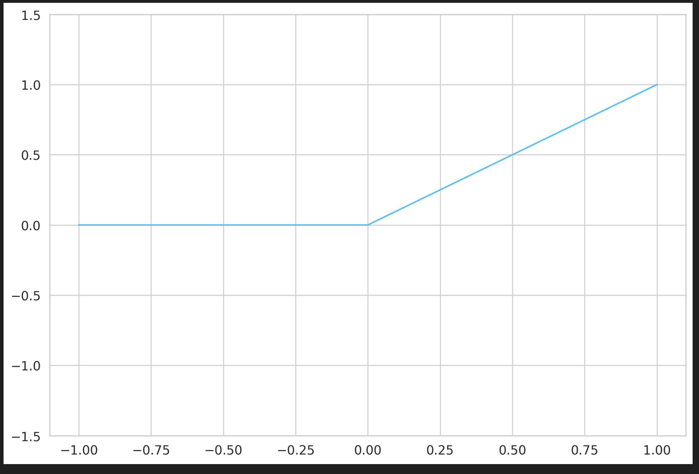
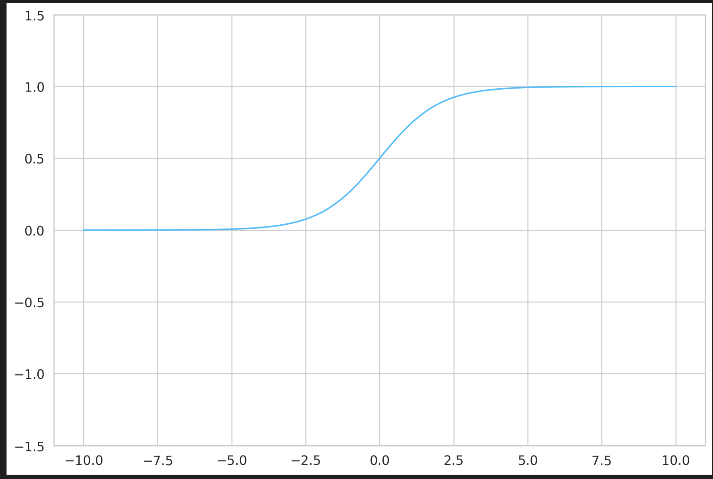
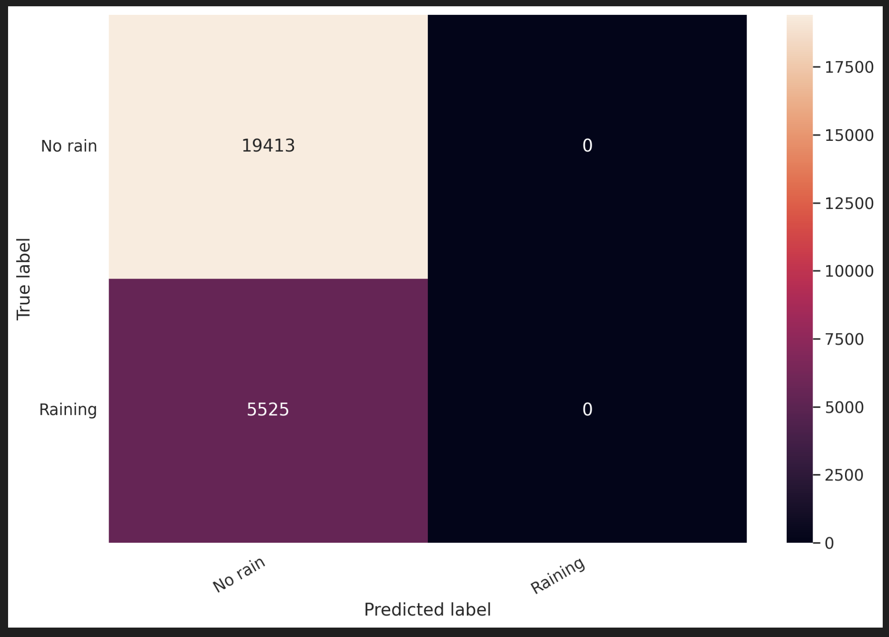

# Rain Prediction — Neural Network (PyTorch)

A binary classification neural network built from scratch in PyTorch
to predict whether it will rain tomorrow using real Australian weather data.
Covers the full ML pipeline — data loading, preprocessing, model design,
training, evaluation, model saving/loading, and visualisation.

---

### What it does

- Loads real Australian weather data directly from Kaggle via kagglehub
- Selects 4 most predictive weather features for binary classification
- Builds a 4-layer fully connected neural network with ReLU activations and Sigmoid output
- Visualises ReLU and Sigmoid activation functions to understand their behaviour
- Trains using BCE Loss and Adam optimizer with GPU support
- Saves trained model as `.pth` and reloads it for inference
- Evaluates with classification report and confusion matrix heatmap

---

### Dataset

Australian Weather Dataset — [jsphyg/weather-dataset-rattle-package on Kaggle](https://www.kaggle.com/datasets/jsphyg/weather-dataset-rattle-package)

Loaded automatically via `kagglehub`. Features used:

| Feature | Description |
|---|---|
| Rainfall | Amount of rainfall in mm |
| Humidity3pm | Relative humidity at 3pm (%) |
| Pressure9am | Atmospheric pressure at 9am (hPa) |
| RainToday | Did it rain today? (0 = No, 1 = Yes) |
| **RainTomorrow** | **Target — will it rain tomorrow?** |

---

### Architecture
Input (4 weather features)
→ Linear(4 → 20)  + ReLU
→ Linear(20 → 16) + ReLU
→ Linear(16 → 8)  + ReLU
→ Linear(8 → 1)   + Sigmoid
→ Binary output (threshold = 0.5)

---

### Training Setup
Loss function   BCELoss (Binary Cross Entropy)
Optimizer       Adam (lr = 0.001)
Epochs          10
Train/Test      80/20 split
Device          GPU (cuda) if available, else CPU
Model saving    torch.save → model.pth

---

### Activation Functions Visualised

**ReLU** — outputs zero for all negative inputs, linear for positive:



**Sigmoid** — squashes output to (0, 1) range for binary classification:



---

### Results

**Confusion Matrix:**



The model correctly classifies the majority No Rain class well.
Class imbalance (more No Rain than Rain samples) affects recall
for the Rain class — a common challenge with weather datasets.

---

### Stack

| | |
|---|---|
| **Framework** | PyTorch |
| **Data** | Pandas · NumPy · kagglehub |
| **Evaluation** | scikit-learn · Seaborn · Matplotlib |
| **Visualization** | ann_viz (custom network visualizer) |
| **Language** | Python |

---

### Setup

```bash
pip install torch pandas numpy seaborn matplotlib scikit-learn kagglehub tqdm

jupyter notebook 1_Neural_Network_Rain_Prediction.ipynb
```

---
